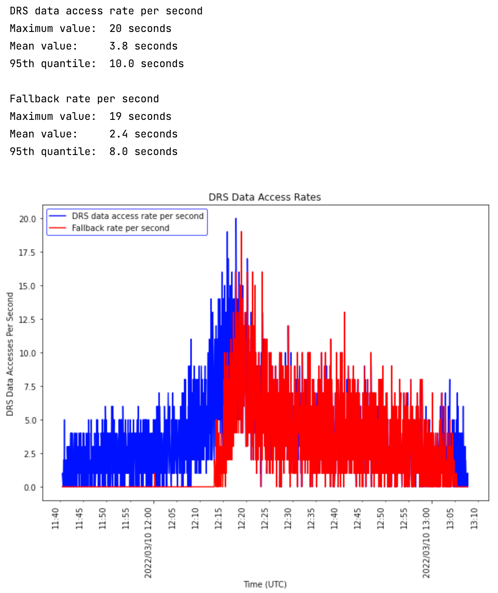
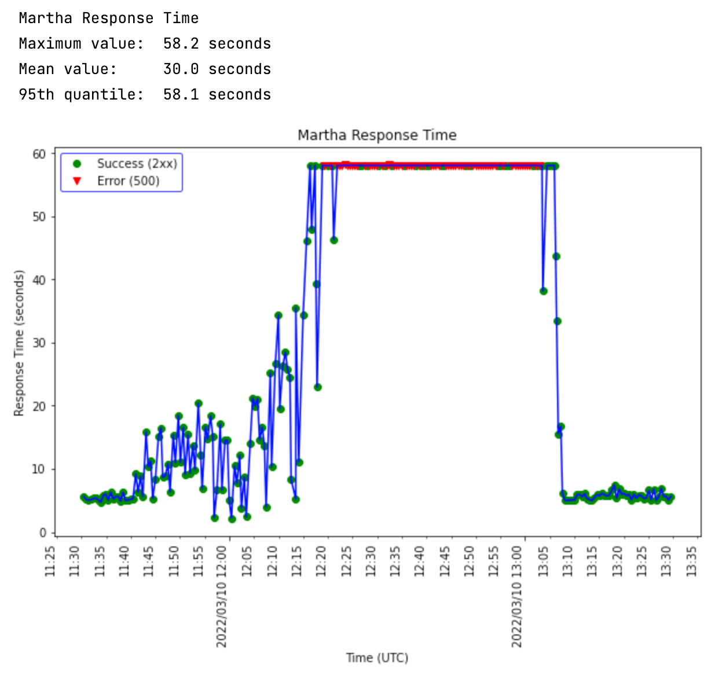
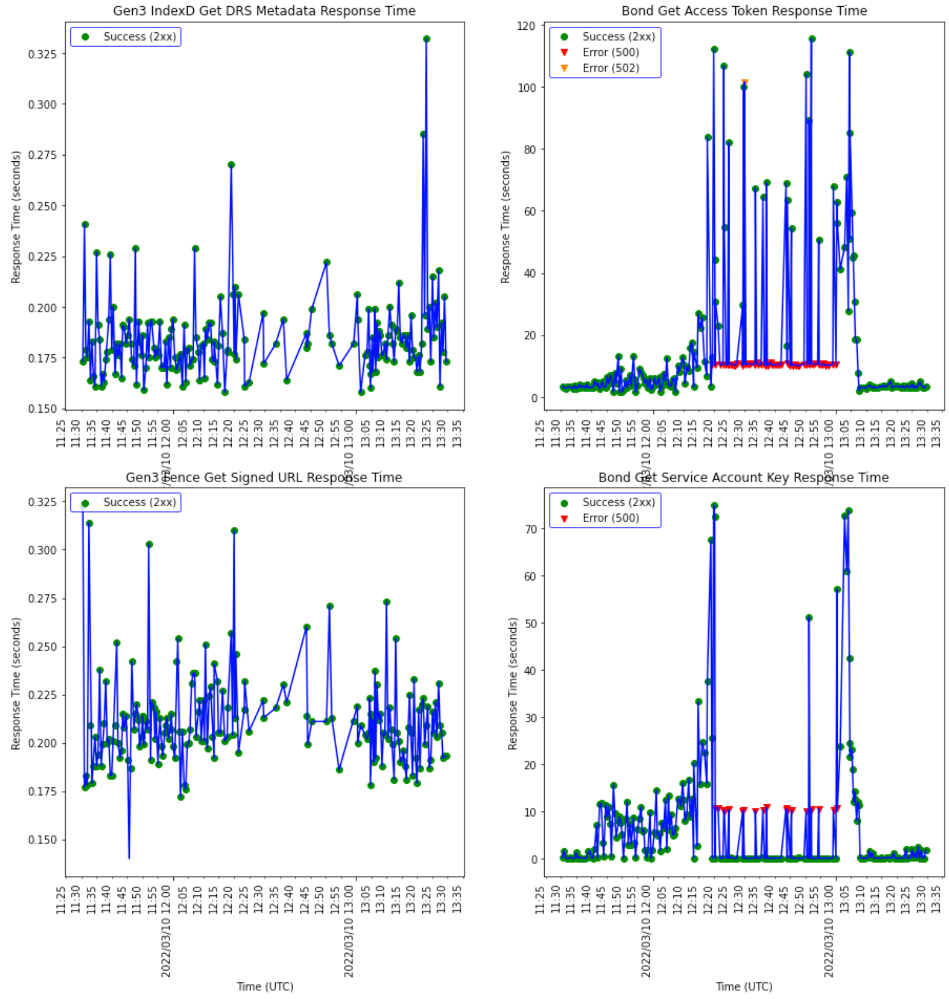
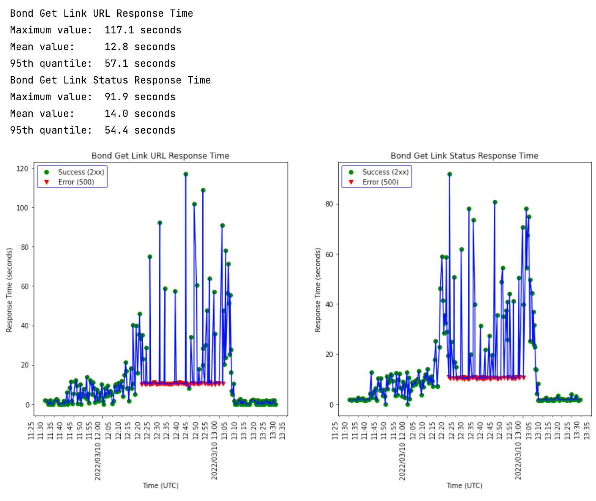

# terra-workflow-scale-test-tools [WIP]

# Description
Testing tools for Terra workflow system scale tests of GA4GH DRS data access.

This includes:
* Test workflow WDL files
* Extraction and graphical reporting of the workflow DRS data access rate
* Monitoring and graphical reporting of the response times for key services/endpoints during the test 

These tools were designed to work:   
* On all Terra deployment tiers (currently `dev` and `alpha` are supported)  
* With all Terra-supported Gen3 projects (currently NHLBI BioData Catalyst is supported)  

The response time monitoring tools can be extended to include additional services (e.g. `terra-drs-hub`) and endpoints.
`
Note: These instructions are written for "newer" workspaces that use the project-per-workspace model.
Older (non-PPW) workspaces can also be used, with some slight modifications to the instructions left as an exercise for the reader/tester.

# Output Examples

## DRS Data Access Rate

## Response Time Monitoring

### Martha Response Times

### DRS Flow Response Times

### Bond Endpoint Response Times

# Test Tool Setup
Setting up the test tools is (semi-)automated because Cloud Environments are deleted weekly (typically on Sundays)
in some Terra pre-production tiers (e.g. `dev`, maybe others).
This then requires frequent re-setup of the test environment.

On tiers where the Cloud Environment is regularly deleted, using `gsutil rsync` to backup the
persistent disk to the workspace bucket at the end of the week is recommended.

## Bootstrap Setup
1. Login to Terra in the desired Terra deployment tier (dev, alpha, ..., prod) in which the tests will be run.  
   Login as `b.adm.firec@gmail.com` (although other user ids also work, if desired)
2. In Terra, create/start a Jupyter Cloud Environment.  
   Recommended miniumum configuration:
   * Image: Current Default (for Python, etc.)
   * CPUs: 4 (or more)
   * Memory: The minimum provided for the number of CPUs
   * Disk space: 50 GB (or more)
3. Start the Terra Terminal for this Cloud Environment
4. The recommended way to use these tools is to do all work in the workspace notebook `edit` directory:    
    `/home/jupyter/<workspace name>/edit`  
If this directory does not exist, then create it by running the following on the Terra Terminal command line in the home directory:  
    Run: `mkdir -p "$WORKSPACE_NAME/edit"`
5. Run: `cd "$WORKSPACE_NAME/edit"`
6. If the `terra-workflow-scale-test-tools` directory does not exist here, then:  
    Run: `git clone https://github.com/mbaumann-broad/terra-workflow-scale-test-tools.git`
7. Run: `cp terra-workflow-scale-test-tools/setup_workflow_test_tools.ipynb .`
8. In the Terra workspace UI, select the Notebooks tab, then open the `setup_workflow_test_tools` Notebook in Edit mode and continue with the instructions there.
